<!-- ============================================ -->
<!--  github.com/etkaturan — profile README       -->
<!--  Design system: ink #070707 · cyan #22d3ee   -->
<!--               · violet #a78bfa               -->
<!--                                              -->
<!--  Images under assets/ are committed to this  -->
<!--  repo and generated by .github/workflows/.   -->
<!--  Nothing here depends on a live third-party  -->
<!--  service at render time — see stats-mirror.  -->
<!-- ============================================ -->

<a href="https://etkaturan-portfolio.vercel.app">
  
</a>

## About

- 🔭 **2 years** building web apps, desktop software and AI-integrated systems — React, Next.js, TypeScript, Python, FastAPI
- 🧠 Sole developer of **[Awen](https://github.com/etkaturan/Awen)** — an AI German-learning platform shipped across **10 production releases**
- 🔬 Built two research-grade tools **adopted by Hof University's Visual Analytics lab** (NER → Neo4j → LangChain pipeline)
- 🎓 B.Sc. Computer Science, Hof University of Applied Sciences · thesis on **Generative AI + spatial hypertext**
- 📍 Fürth, Germany · **EU Blue Card eligible** · open to full-time roles and freelance projects

  

## Featured Projects

<table>
  <tr>
    <td width="50%">
      <a href="https://github.com/etkaturan/Awen">
        
      </a>
    </td>
    <td width="50%">
      <a href="https://github.com/etkaturan/AI_ME">
        
      </a>
    </td>
  </tr>
  <tr>
    <td width="50%">
      <a href="https://github.com/etkaturan/ai-supported-spatial-hypertext">
        
      </a>
    </td>
    <td width="50%">
      <a href="https://etkaturan-portfolio.vercel.app">
        
      </a>
    </td>
  </tr>
</table>

## Tech Stack

  

## GitHub Analytics

<!-- Mirrored daily by .github/workflows/stats-mirror.yml.
     Served from this repo, not from the upstream service, so an outage
     upstream leaves the last known-good card in place instead of a
     broken image. -->

  
  

 

  

## Contribution Graph

<!-- Generated daily by .github/workflows/pacman.yml, committed into this
     repo rather than published to a separate branch. -->

  <picture>
    <source media="(prefers-color-scheme: light)" srcset="assets/pacman/pacman-contribution-graph.svg" />
    
  </picture>

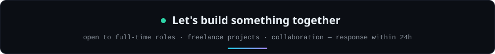

&nbsp;

&nbsp;

